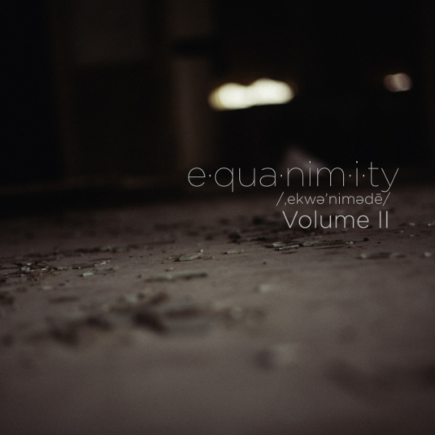
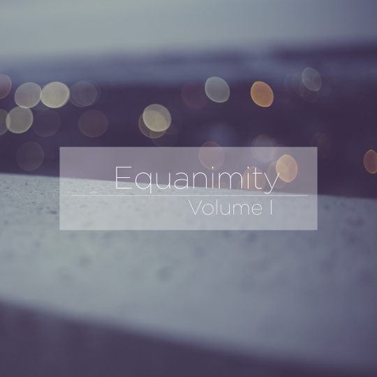

This is Equanimity; a series of focus centered playlists that I've created.
I made these playlist with one purpose, to help me focus. Each playlist is roughly the length of a single work day. I hope you get enjoyment out of these.

# e·qua·nim·i·ty #

## ˌekwəˈnimədē/ ##  

noun mental calmness, composure, and evenness of temper, especially in a difficult situation.

Equanimity is mental calmness, and that’s what I need when I’m at work. Office life can be busy and distracting, especially when your company is rebuilding its entire website from the ground up. Equanimity is my attemt to stay focused, and I decided to share it with all of you. I will be releasing different volumes of Equanimity periodically. I’m not entirely sure when the next volume will come out.

<iframe src="https://embed.spotify.com/?uri=spotify%3Auser%3Achancellorr%3Aplaylist%3A5Dz3iEAqYJbekllThnx1VD" width="540" height="380" frameborder="0" allowtransparency="true"></iframe>  

<iframe src="https://embed.spotify.com/?uri=spotify%3Auser%3Achancellorr%3Aplaylist%3A24okznK9GEZ2hb3AWW8DUX" width="540" height="380" frameborder="0" allowtransparency="true"></iframe>  

<iframe src="https://embed.spotify.com/?uri=spotify%3Auser%3Achancellorr%3Aplaylist%3A4KzmAmZxXbqo0bgmzN3NOO" width="540" height="380" frameborder="0" allowtransparency="true"></iframe>  
